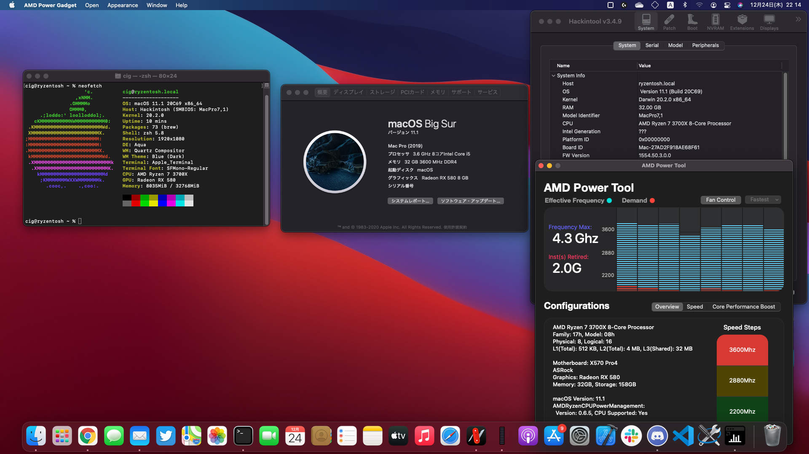
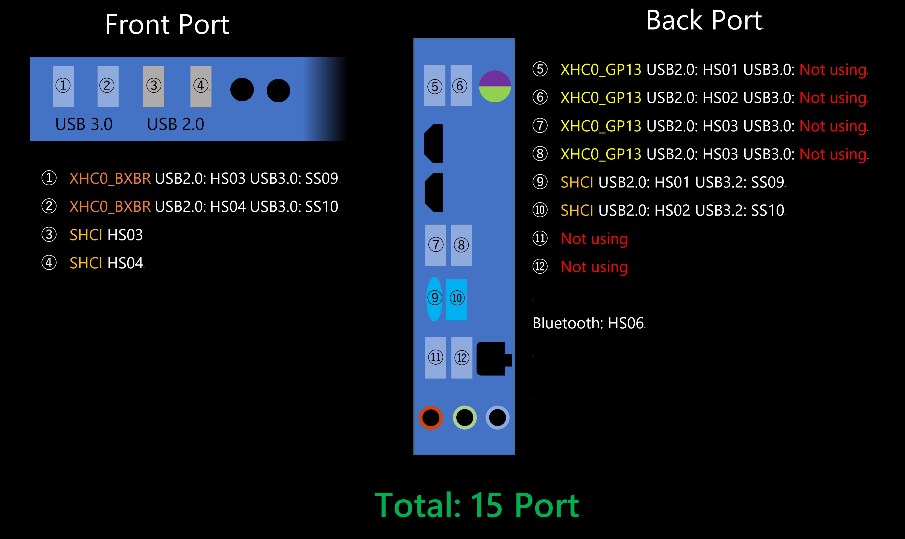

# My Ryzenyosh!!

This is my hackintosh files.

SMBIOS:MacPro7,1

last modified: 
- OpenCore 0.6.4
- Working macOS 11.1

# My Ryzentosh's Composition

- CPU: AMD Ryzen 7 3700X
- GPU: ASRock Radeon RX 580 8GB OC
- MB: ASRock X570 Pro 4 (Bios Version: 3.40)
- Memory: G.Skill DDR4 16GBx2 3600mhz (F4-3600C19D-16GSXWB,apply XMP2.0)
- SSD1(Installed macOS): Sandisk SSD Plus 240GB SATA
- SSD2:CFD NVME SSD 512GB (CSSD-M2M5GEG1VNE)
- Wifi/BT: Intel Wifi 6 AX200

# Working

- Graphic
- USB Mapping
- Power Management (using [SMCAMDProcessor](https://github.com/trulyspinach/SMCAMDProcessor))
- Wifi/BT (using [AirportItlwm](https://github.com/OpenIntelWireless/itlwm))
- checkra1n
- Apple Secure Boot
- iMessages and Facetime
- Everything else NOT listed in not working

# Not Working

- Sleep (Wifi is the cause?)
- AirDrop (Itlwm don't support now)

# unconfirmed

- Sidecar
- Unlock macOS with Apple Watch
- Thunderbolt 3

# USB Map

Note: This is X570 Pro4's USB Map.

For other motherboards, it is recommended to follow [the guide](https://dortania.github.io/OpenCore-Post-Install/usb/).

# BIOS Configuration

- Above 4G Decoding: **Enable**
- Wake on LAN: **Disable** (If it doesn't Disable, PC will have problems with shutdown🤔)
- Fast Boot: **Disable**
- SATA Operation: AHCI
- Secure Boot: Disable

# Note

## kext
if you do not use Intel Wifi or Polaris GPUs, please remove the kext related to them before using them.
### Only for Polaris GPU
- RadeonBoost.kext
- RadeonMonitor.kext
### Only for Intel Wifi
- IntelBluetoothInjector.kext
- IntelBluetoothFirmware.kext
- AirportItlwm.kext

## DeviceProperties

DeviceProperties are applied to some PCIs, which are set to display the internals of the nvme SSD in macOS.

(SATA SSDs can be configured with ExternalDiskIcons, since they are the drives on which macOS is installed.)

## ACPI

I've put in a lot of .aml files to solve the sleep problem, but haven't solved it yet.
However, this is probably a wifi issue as sleep worked only once when I turned off the wifi.
So I have left it.

## Other

I followed the OpenCore guide for many of the settings.
So if there are any settings you don't understand, you can look at the OpenCore configuration.

# Credits

- Acidanthera for OpenCore
- Dortania for OpenCore's guide
- [AMD-OSX for Kernel patch](https://github.com/AMD-OSX/AMD_Vanilla)
- [trulyspinach for SMCAMDProcessor](https://github.com/trulyspinach/SMCAMDProcessor)
- Aluveitie[Ryzen Mac Pro - OpenCore EFI for ASRock X570 ITX](https://github.com/aluveitie/RyzenMacPro) for some hint.